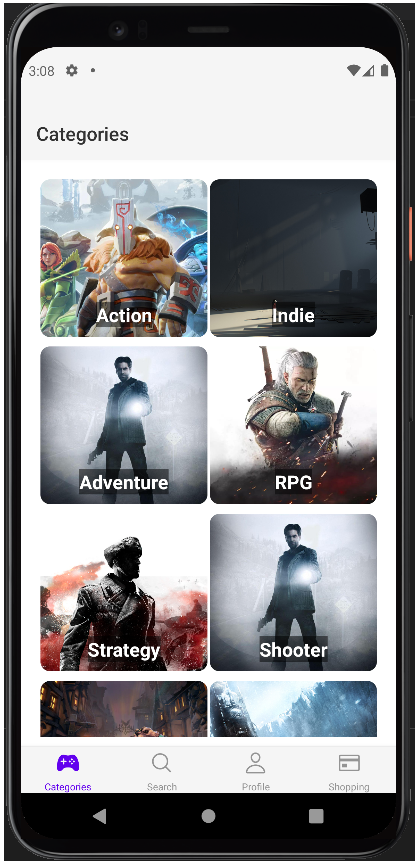
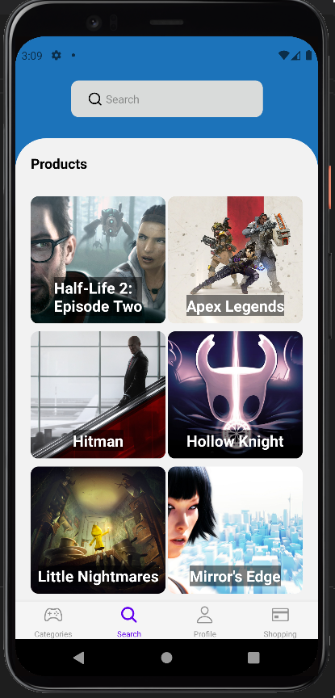

# Spring 2023 OAMK mobile project

## Project name: GameStoreApp [demo video (finnish only)](https://www.youtube.com/watch?v=bO8OB8lTldI)

## Technologies an tools

### Frontend
For frontend we used React native. Npm was used for installing packages and expo was used for runtime environment.

### Backend/Database
For backend we used Firebase for user authentication, API functions and Realtime database to store user data. Firebase was easy to use and it was easy to build UI to top of Firebase.

## What everyone did

### Väinö Kasurinen 

Worked with UI and with API, made navigation for the application and made improved version for login and register screen.
[Link to Väinö's Github](https://github.com/VKasurinen)

### Anssi Rauhala

Mainly worked on the apps frontend. Made profile screen which includes dark mode and password changing, also worked on shoppingcart screen and order confirmation.

### Pictures from the application

